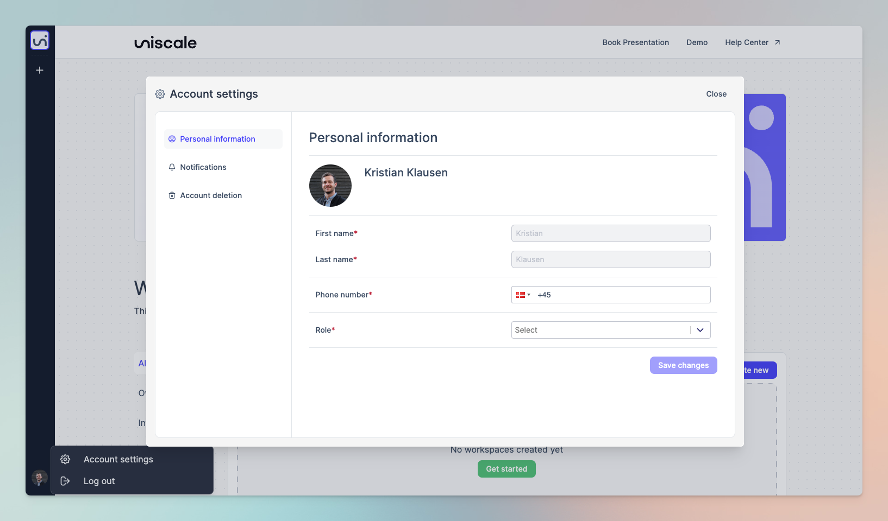

# Manage your account

## Access Account settings&#x20;

<figure><figcaption>
How to change account settings 
</figcaption></figure>

***

## Edit account settings&#x20;

### Go to Account settings

From the Uniscale Dashboard click the profile icon on the bottom left corner of the page and select "Account settings"

<figure><figcaption></figcaption></figure>

### Update personal information

Select "Personal Information" from the left-hand side. Update any of the fields and press "Save changes" when done.

<figure><figcaption>
Personal information
</figcaption></figure>

### Update email notifications

Select "Notifications" from the left-hand side menu and edit the field

<figure><figcaption>
Email notifications
</figcaption></figure>

### Delete account

Select "Delete account" if you wish to delete your account


Are you on a subscription? Please reach out to help@uniscale.com and request to cancel your subscription before deleting your account.


<figure><figcaption>
Delete account
</figcaption></figure>

## Link multiple Accounts

If you signed up using your email to create an account, you have the option to connect it with your Google, Microsoft, LinkedIn, or GitBook account later on, provided that the email you used matches. This will simplify the login process for you in the future.

To link accounts, select the account you want to connect on the main log-in page.

<figure><figcaption>
Connect different acounts for a simplified login process
</figcaption></figure>

Your computer will automatically detect that the email you have previously used is associated with another account and merge the two. This will enable you to log in using the new method, rather than having to enter your email address and password every time you log in.

\
