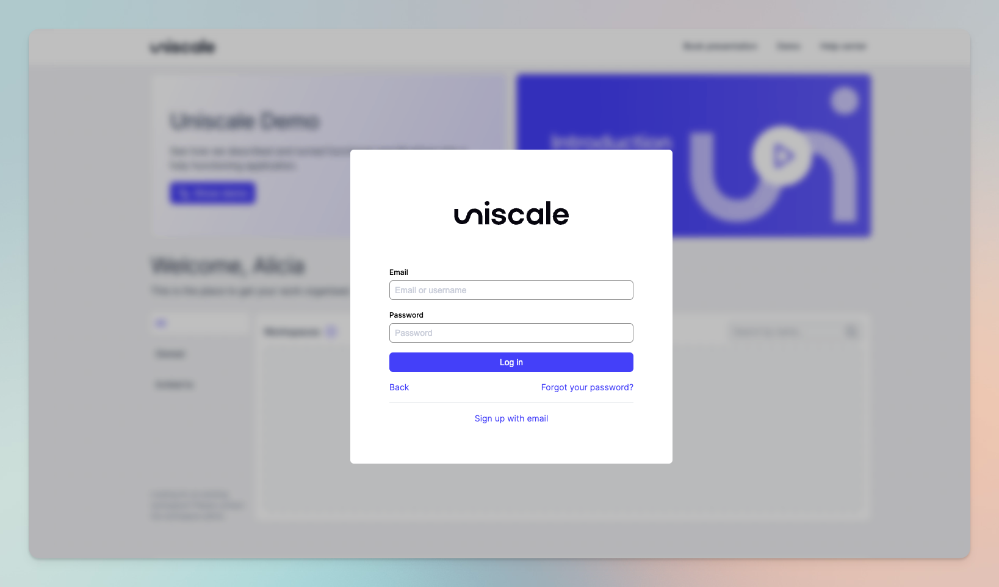
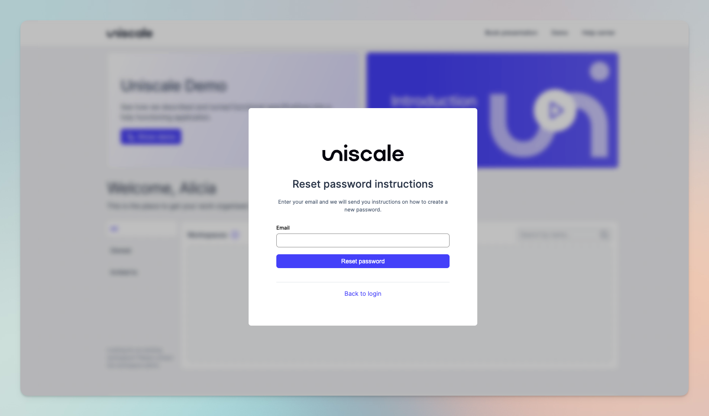

# Reset my password

If you have forgotten your password, click the link below to reset your password.

Link: [Reset my password](https://identity.uniscale.com/realms/uniscale/login-actions/reset-credentials?client\_id=lobby\&tab\_id=YVL\_d17Il4w)

## Step-by-step guide: Reset my password&#x20;

Is the link above broken? No worries, here is a short guide on how to reset your password:&#x20;

From [Uniscale.com](https://app.uniscale.com), select the option “You can also log in with email”. Insert your e-mail address and click on “Forgot Your Password?”.

<figure><figcaption>
Log in screen from where you can click "Forgot your password?"
</figcaption></figure>

You can now insert your email and click "Reset password"

<figure><figcaption></figcaption></figure>

You will now receive an email where you can select the option “Reset Password”:

<figure><figcaption></figcaption></figure>

Please note that the “Reset Password” link expires after 60 minutes.

## Tip: Link your account

If you signed up using your email to create an account, you have the option to connect it with your Google, Microsoft, LinkedIn, or GitBook account later on, provided that the email you used matches. This will simplify the login process for you in the future.

Learn more here: [Link multiple Accounts](https://help.uniscale.com/account-and-preferences/manage-your-account#link-multiple-accounts)

