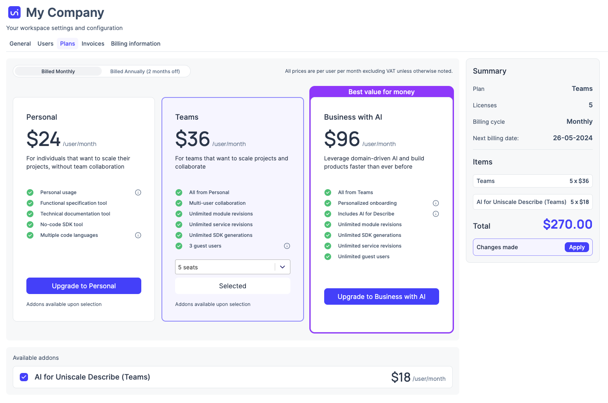

# Plans and subscriptions


Check [here ](https://www.uniscale.com/pricing)to see which plans we have available and which options to choose from to make the most out of Uniscale.


## Which plan is my Workspace currently on?

To get an overview of your current plan, go to your [workspace-settings.md](../workspace-administration/manage-workspaces/workspace-settings.md "mention") and select "Plans"

<figure><figcaption>
Uniscale Plans
</figcaption></figure>

## How to change Workspace plan

If you wish to change your subscription plan, you can do so from the Plans page.


Note that downgrading your plan will only apply once the add the next billing date.&#x20;


## How to change number of seats to your Workspace

Once you have selected a plan, you will be able to adjust the amount of seats. Note that there may be restrictions to the amount of seats available depending on your plan.&#x20;

