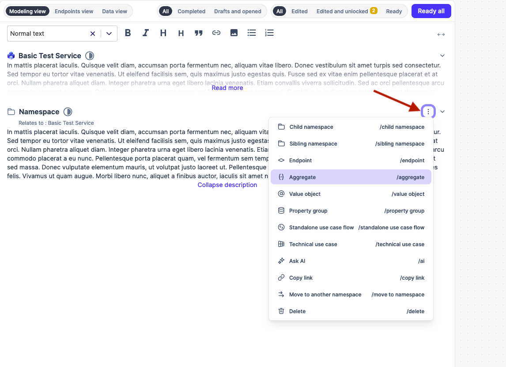
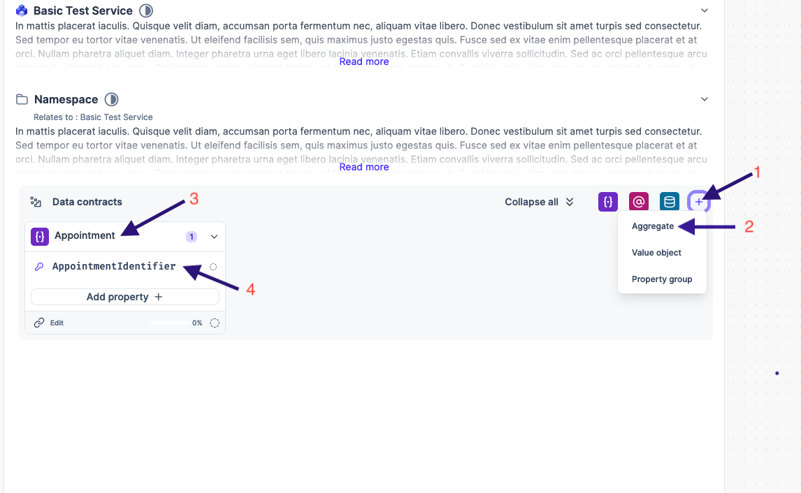
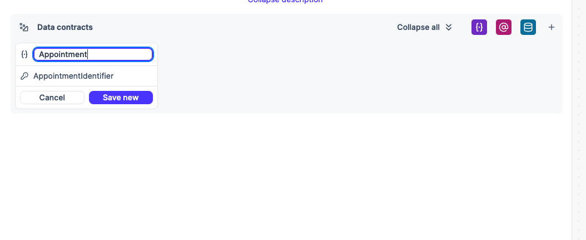
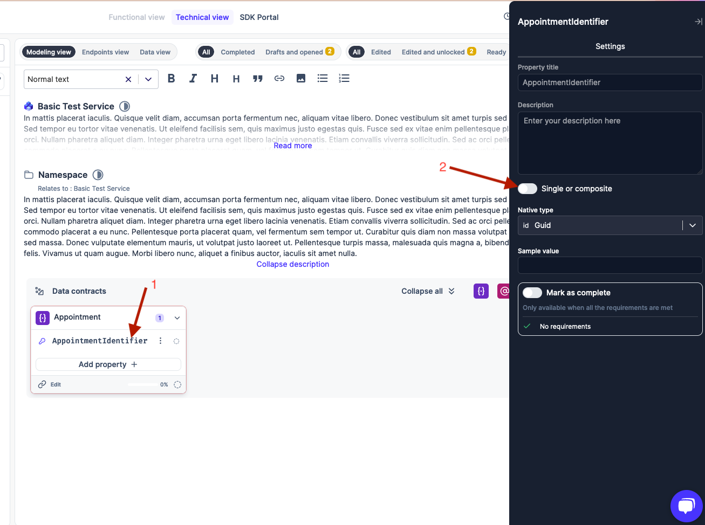
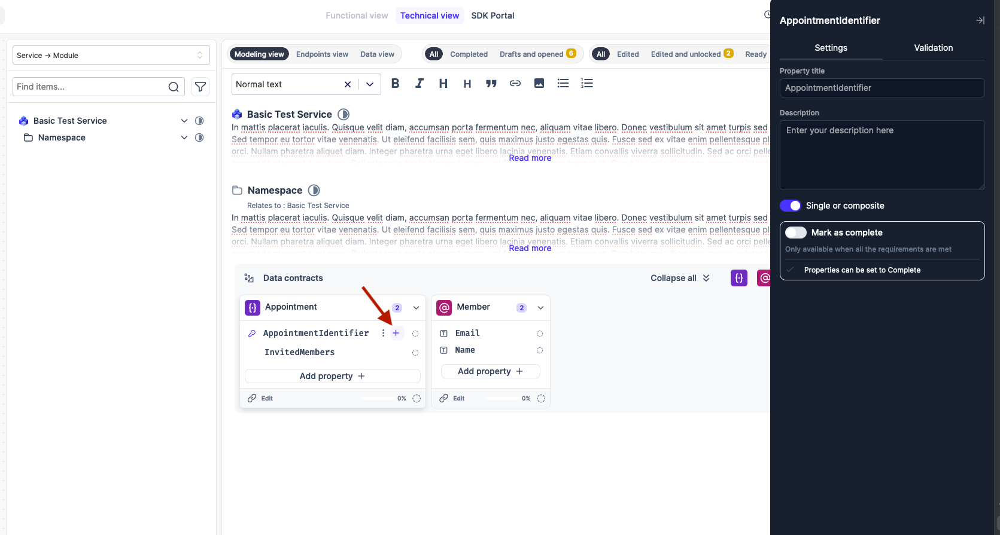
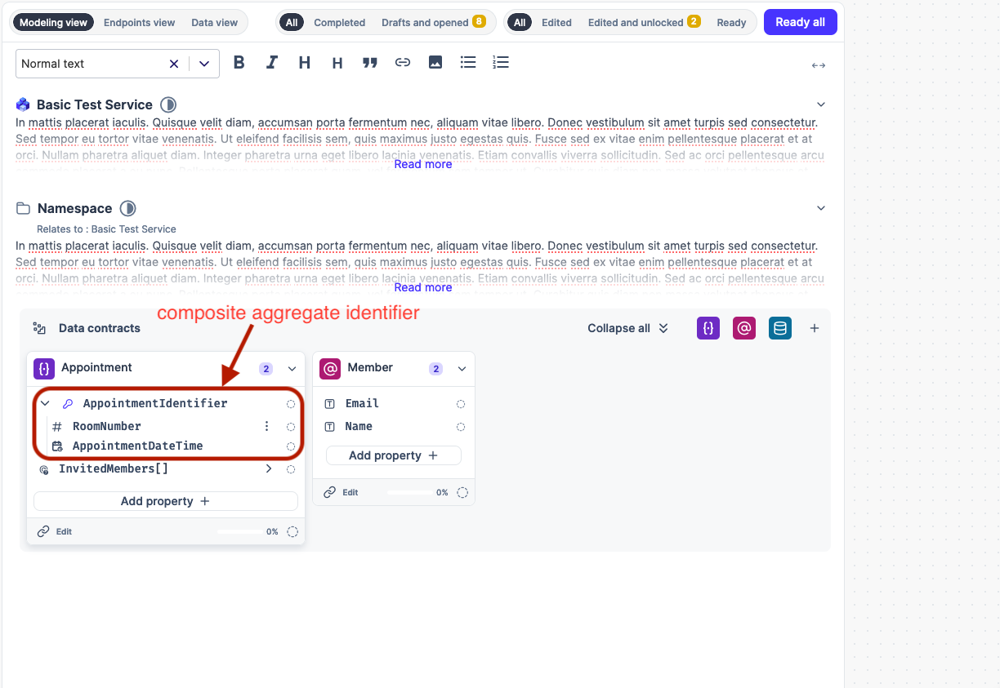

# Composite Aggregate Identifiers

## What are Composite Aggregate Identifiers?

In the realm of data modeling and domain-driven design (DDD), a composite aggregate identifier is a unique identifier composed of multiple attributes or values. Unlike simple identifiers like UUIDs or auto-incrementing integers, composite identifiers leverage the combination of two or more fields to guarantee the uniqueness of an entity or aggregate within a system.


## Why Use Composite Aggregate Identifiers?

**Business Meaning**: Composite identifiers often carry inherent business meaning, reflecting the relationships or attributes that define a specific entity. For example, an appointment item's identifier might consist of the roomNumber and appointmentDateTime.

**Flexibility**: They allow for more nuanced identification schemes compared to simple identifiers. This is particularly useful in complex domains where entities might be uniquely determined by combinations of factors.

**Data Integrity**: Composite identifiers can help enforce business rules and constraints by encoding them directly into the identification mechanism.


### Design Considerations

**Immutability**: The components of a composite identifier should ideally be immutable. Once set, they shouldn't change as this would break the entity's identity.

**Uniqueness**: The combination of attributes must guarantee uniqueness within the relevant scope (e.g., within an aggregate, or across the entire system).

**Minimalism**: Include only the necessary attributes required for uniqueness. Avoid adding unnecessary complexity.

**Serialization**: Consider how you'll represent the composite identifier when serializing it to a database or transmitting it over a network.

Example: Appointment Item

```java
class AppointmentItem {
    RoomNumber roomNumber; // Part 1 of the identifier
    DateTime dateTime; // Part 2 of the identifier
}
```

In this example, an AppointmentItem is uniquely identified by both the roomNumber (referencing a RoomNumber) and the dateTime.

### Implementation Considerations

**API Design**: When designing APIs, carefully consider how you'll expose and handle composite identifiers. This might involve using compound objects or custom serialization formats.

> Composite identifiers introduce some additional complexity compared to simple identifiers, especially in terms of API interactions.


### Adding Composite Aggregate Identifiers in Uniscale Aggregates

After opening up a service to model and you have set up your initial namespace. you can directly create an aggregate as shown in _Figure 1_&#x20;

<figure><figcaption><p>Figure 1</p></figcaption></figure>

For the cases of an already existing service that has been modeled, you can alternatively create the aggregate as shown in steps labeled <mark style="color:red;">1</mark> and <mark style="color:red;">2</mark> in _Figure 2_

<figure><figcaption><p>Figure 2</p></figcaption></figure>

Upon selecting aggregate in step labeled <mark style="color:red;">2</mark>, you will be provided with a data component to allow you to define the name of your aggregate that we later see as _**Appointment**_ in step <mark style="color:red;">3</mark> in figure 2.

<figure><figcaption><p>Figure 3</p></figcaption></figure>

> Figure 3 defines the data component that allows you to name your aggregate. and notice that the identifier for the aggregate is being added as you type.

<figure><figcaption><p>Figure 4</p></figcaption></figure>

Click on the aggregate identifier as illustrated in step <mark style="color:red;">1</mark> of F_igure 4._ This will open a side panel on the right that will offer some extra settings/options to set for the identifier selected. at this point, toggle the single or composite action as shown in step <mark style="color:red;">2</mark> of _Figure 4_ which will then allow you to add the properties that comprise your composite aggregate identifier from the **+** button below in _Figure 5_

<figure><figcaption><p>Figure 5</p></figcaption></figure>


Finally, you can continually add more properties and define using the same + button shown above to build your composite aggregate identifier.  in this case, the final composite aggregate identifier is illustrated in _Figure 6_ below

<figure><figcaption><p>Figure 6</p></figcaption></figure>
