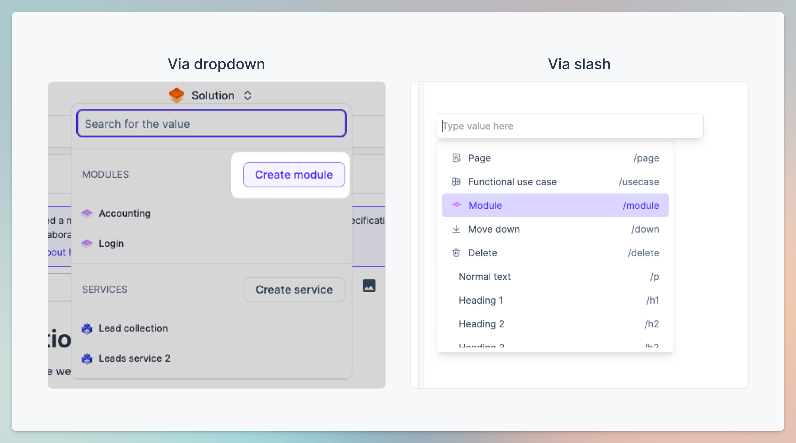

# Get started with a module

You can watch the video or read the explanation below:


Let's go through and write our first module revision specification


## What does a module consist of?

Modules are structured using Pages, Sections, and Functional use cases.&#x20;

### Pages and Sections&#x20;

These are the elements that you will use to align the structure of your application in the same way as the product. In that way, it will be easier to navigate your way within a module in relation to your product.

<figure><figcaption>
The structural breakdown of a module specification using Pages and sections.
</figcaption></figure>

### Functional use cases

Functional use cases are used to define the user behavior within the module. Each functional use case consists of a description, where you can describe the high-level user behavior.&#x20;

Read more in this article: [functional-use-cases.md](functional-use-cases.md "mention")

***

## Best practices when describing a module

### Cater to your audience

As these are the functional requirements for your solution, it is important that all your stakeholders can easily navigate and make sense of your specifications. This ensures optimal communication and alignment. To achieve this you must define the right information within the right elements.&#x20;


Use Pages and Sections for high-level explanations while using Functional use cases for more detailed explanations. In this way, when filtering out Functional use cases, you have a high-level point of view for aligning all stakeholders.


Within Pages and Sections, you can describe high-level specifications of your functionality. In this way, all stakeholders can use this part of the specification to make sure that everyone has a high-level alignment of the functionality and the intentions that led to its current state. From there the reader can enable Functional use cases or even UX flows and designer notes to dig into the details needed to implement the requirements.

### Make use of visuals


Type "/" or click the "..." menu to start creating content within your specification.


To start your module specification, we recommend using mocks of the user interface. You can insert images of your mock, screenshot, or even drawing right into your module specification.

This helps the reader better have the context and understand what you are trying to achieve with your solution.&#x20;

***

## Guide: Create and describe your modules

### Step 1: Create a module

To create a module, you can either use the "/" menu or you can use the "Create module" button in the top solution context bar.


By selecting a module in the solution context dropdown, you can get to the module focus view. In there, you can approve your module revision, look at previous revisions, and more.


<figure><figcaption>
Create modules either through the / command or by using the solution context menu at the top.
</figcaption></figure>

### Step 2: Specify the first module revision

To start specifying your module, please watch the video at the top of this page where we will go through the elements used to write it and some decisions behind why and how.

You can also continue to learn about [#functional-use-cases](get-started-with-a-module.md#functional-use-cases "mention")

***

## Summary

Modules consist of Pages and sections to define the overall and structural build-up. They are used to communicate high-level functionality for all stakeholders. The details about the user interaction are described in Functional use cases. Read more about those in the next article.
