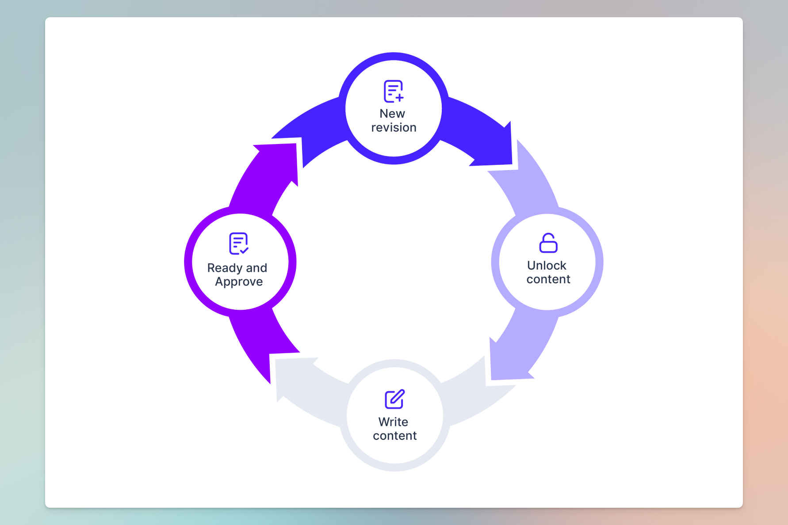

# Module revisions, readying and approving


The module revisions are part of the module editor. This means that you need to select a specific module in the solution context menu to access revisions and approval.


## Starting and approving a module revision


Let us add some functionality to a module through revisions


## Iteratively specifying and delivering your product

In [How to get started with a solution](https://help.uniscale.com/product-guides/how-to-get-started-with-a-solution), we describe how splitting a solution's end-user functionality into modules helps you scale your teams with your organization strategy.&#x20;

Each team will be able to define new functionality by starting, readying, and approving revisions within the module.

<figure><figcaption>
Make your Uniscale solution the single source of truth to the intentions and decision that has made your product what it is. Use revisions to incrementally build your specification so that you can effectively release your functionality.
</figcaption></figure>

For each module, you can work with the current revision and look back at any of your older revisions. In this way, you have a complete overview of the product intention and decision history.

## The module revision flow

The first revision you write will take you into the "Write content" step. In the first revision, all content is new so there would be nothing to unlock. However, you will still go through the step of marking your content as ready so that you can incrementally lock down parts of your specification. Your last step when everything is marked as ready is to approve the revision. This is the flow you will go through every time you want to release changes to your product.

<figure><figcaption>
Every new revision will go through the same flow of initiating, unlocking content you wan to change, writing / editing content and then lastly readying content and approving it.
</figcaption></figure>

If you also use services in your solution, the service documentation will happen between having marked your content as ready and approving. As such the module revision acts as an umbrella covering both the functional specification and the technical modelling. The reason for this is that often when defining the service documentation you find missing or unclear specifications. Being able to lock this down will save you and your team a lot of frustration.


If you can lock down your service boundaries, you have already discovered 95% of your unknowns.


## Unlocking and readying

When starting a new revision, all elements will be in the locked state. This means that you have started a revision but you have not made a decision to make changes to any of the content yet. To make changes to existing content, you have to unlock that element first. This allows you to keep track of what you have changed or intend to make changes to.&#x20;

You can use the filters to only see elements that you have either unlocked or made changes to. This is helpful as your specification starts to grow. You can also use the unlocking as an agreement between stakeholders as to what you intend to make changes to. In that case, you can unlock certain parts of the specification up-front and initiate a conversation every time you realize that additional parts of the specification need to be changed.&#x20;


Use unlocking to both keep track of what you have changed and also as an alignment with stakeholders on what is expected to change.


In the same way as using unlocking to align on what will change you can use the readying to keep track of the part of the specification that you are done with and what you have left. When writing larger and more complex specifications it is really helpful to be able to lock down parts of your specification as you go so that you systematically can approach the point where you know you are done.

## Approval

The last step is to approve the specification. If you are also defining services, you will complete your service revisions ahead of approval. If you are only using the functional specifications you will go on to approve the specification after everything has been marked as ready. When approved the specification is locked and you are ready to in the future start new revisions.

***

## Conclusion

You iteratively define your module's functionality by starting, specifying, and approving revisions in your module. You can use unlocking to align with stakeholders on what is expected to change existing functions. You can also use readying as a way of tracking your progress against completing your revision. Through multiple iterations and gradually adding functionality to your solutions modules the specification will be the single source of truth for all intentions and decisions making your product what it is today. Through the module revision history, you can go back in time and look at all your historical decisions.
