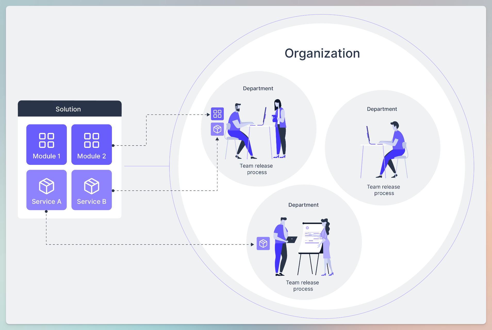

# Solution basics


This article will explain each of the elements in Uniscale that allows you to break describe and structure your specification. \
\
If you want to start using Uniscale, please check our [quick-start-guide.md](../../getting-started/quick-start-guide.md "mention")


## Solution elements

In this article, we will explain each of the elements in Uniscale that allows you to break describe and structure your specification.&#x20;

In this video you will get a short introduction to the structure of a specification:&#x20;


Video: Uniscale Describe: Solution Design Flow


<figure><figcaption></figcaption></figure>

## Solution


A solution is the product, project, or system that you are working on. It contains all the information such as your functional specification and technical documentation.&#x20;


In Uniscale, we provide various elements to describe and structure your solution. In this article, we will go through each of the elements and explain their purpose and functionality.

<figure><figcaption>
Illustration of the elements of a solution and how they are related.
</figcaption></figure>

**Examples of different solutions:**&#x20;

* A desktop application for keeping inventory of a storage space&#x20;
* A web application for organizing shifts for staff in a grocery store
* A communication system for an elementary school’s teachers and parents

<figure><figcaption></figcaption></figure>

## Module


A module is a functionally isolated part of the software that has distinct ownership over its functionality and revision lifecycle.&#x20;

Modules let you place a boundary in the solution at points where it makes sense to divide responsibilities for parts of the software.&#x20;


<figure><figcaption>
Illustration of how a solution consits of multiple modules.
</figcaption></figure>

#### Examples of modules could be:

* User and account
* Payment
* Inventory
* Content management‍

### Best practices for creating modules

Modules: Advanced concepts

**Defining module boundaries**

Create clear boundaries in your software where responsibilities naturally divide. Modules are self-contained parts of the software with specific ownership and independent updates.&#x20;

Clear module boundaries are crucial for your organization.

**Modules to follow your product structure**

Each module update should be treated as a separate project. Keep changes mostly within one module. Group elements that evolve together. This makes your application easier to update and maintain.

This approach allows you to scale as your solution evolves.

**Organize modules based on ownership**

Defining your module boundaries allows you to shape how your organization will grow. Grouping functionality through module and service boundaries affects the future structure of the organization. It's best to have a single team own an entire module to avoid shared ownership issues.&#x20;

This prevents the need for separate projects that are tightly coupled and must be released together.

<figure><figcaption></figcaption></figure>

## Pages


Pages define the top-level structure of a module.&#x20;


Use pages to break down the structure of your solution. In the image below, you will see an example of two pages: Timeline and Direct message. These are both created as pages in the Uniscale solution.

<figure><figcaption></figcaption></figure>

Creating pages is part of the detailed specification that is described further here: [describe-your-detailed-specification.md](describe-your-detailed-specification.md "mention")

<figure><figcaption></figcaption></figure>

### Sections


Sections help break pages into manageable chunks, ensuring every detail in your description is captured.


The idea is to keep breaking them down into a structure of nested sections to define the interface.&#x20;

A section can be further broken down into:

* **Sibling section**: A section that can be added on the same level as others.&#x20;
* **Child section**: A subsection to a section for further breaking down the structure.

<figure><figcaption></figcaption></figure>

## Functional use case


Functional use cases describe the user **behavior** within a module or page. This is in contrast to pages and sections that describe the **structure**.


A functional use case (FUC) can be used for two purposes:

* **Abstract**: To describe the high-level user behavior of a module. An example can be to describe how a new user to your product should be onboarded.
* **Concrete**: To describe the concrete behavior of a page or section. An example can be to describe concrete steps for what should happen when clicking on a button.

A Functional use case can further be broken down into the following elements:

* UI Designer notes
* UX Product notes
  * UX Flows
    * Functional acceptance criteria
    * Service flow
      * Functional acceptance criteria

### **UI Designer notes**

For every User Interface (UI) element there is a UI designer note where your designer or product lead can describe the functionality and the restrictions you envision for that part of the UI.

Examples of a UI designer notes

* Displayed information
* Buttons
* Areas that can expand and collapse
* Drag and drop interfaces
* Popups and triggered displays of information

<figure><figcaption></figcaption></figure>

### UX Product notes

The UX Product notes allow you to add notes and provide a detailed description regarding the intended user experience for a specific functional use case.

#### UX flow

UX flows describe the detailed behaviors within functional use cases.

<figure><figcaption></figcaption></figure>

<figure><figcaption></figcaption></figure>

### Functional acceptance criteria

A list of qualifications that the implementation of the UX flow needs to fulfill.&#x20;

Examples of functional acceptance criteria

* Assurances for accessibility of variable screen types and sizes (don't show on mobile, etc)
* Front-end effects and animations  (disabled buttons, etc)
* Error handling such as password length not matching, etc


You can use our generative AI to help suggest acceptance criteria. Learn more here: [using-ai-in-specification.md](using-ai-in-specification.md "mention")


***

<figure><figcaption></figcaption></figure>

### **Service flow**


Service flows are the first steps towards creating your technical documentation.&#x20;

This part should be done by people familiar with your existing services, like a Solution Architect or Tech Lead.


For each UX flow in your solution, you can create a Service flow to begin to link your functional specification directly to your services.

***

### Service

A service refers to a discrete unit of functionality or capability provided by a system or application.

Each service is defined by its inputs, outputs, behavior, and interactions with other components of the system. Describe the requirements for the underlying technical flows that will enable you to build the desired functionality.


To learn more about Services, visit our detailed [Service basics](../documentation/service-basics.md) article


***

## Functionalities

Richt text editor

Our Rich text editor allows you to write your specifications using advanced styling options (heading, bold, italic, bullet points, and many more) and to embed media, images, and hyperlinks.

AI Functionality

Our AI functionality will provide your code generator with the needed domain-driven product information so you can work on your code much faster and with reduced costs.

Comments 

You can also comment on different sections of your solution allowing you to add notes to the development process that can be seen and answered by your colleagues.

Commands 

Uniscale offers a wide range of commands that allow you to write your specifications and build your solution in a matter of one simple click.

Share Solution

As you work on developing your solution inside Uniscale, you can also share it with your colleagues and bring in more people to work with you.

***
