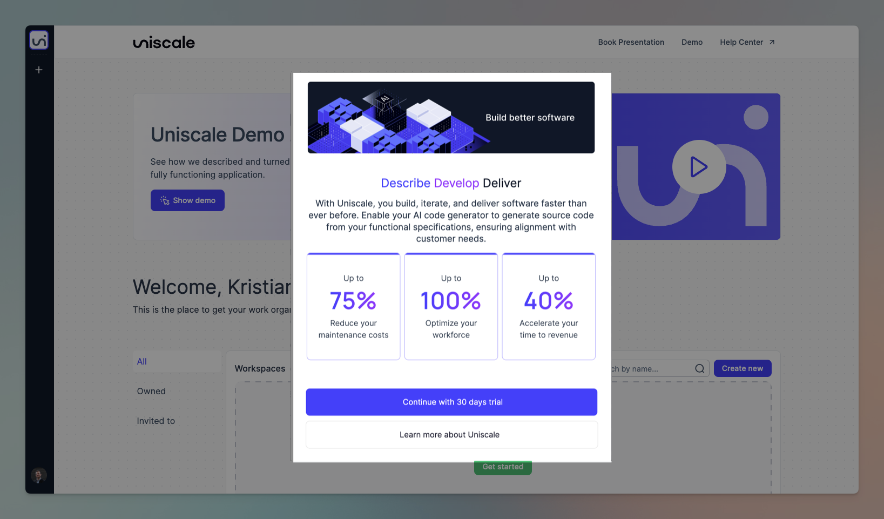
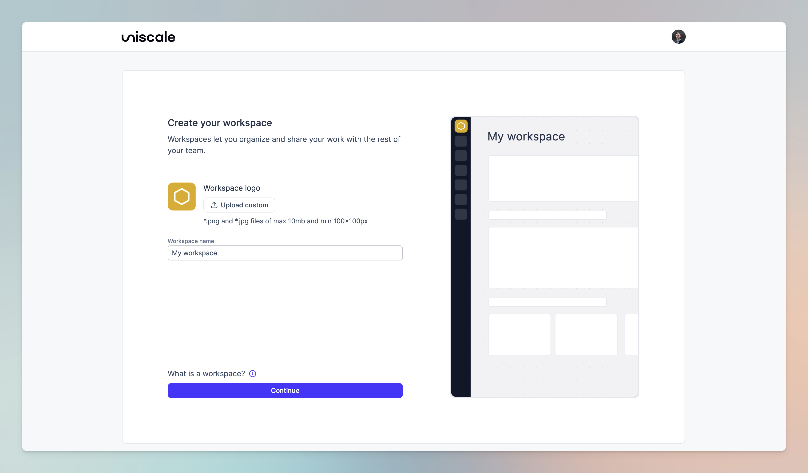

# Create a workspace

## What is a workspace?

Your workspace is the place where your team can specify, model and interact with solutions and services within in.


Upon creating your initial workspace, you'll begin a 30-day free trial with Uniscale to ensure our services meet your needs.


## How to create a workspace

You can create a workspace by following these steps:

### Step 1: Start your new workspace

When you log in to your Uniscale account for the first time, you will be prompted with a guide to help you get started. Click the blue button "Continue with 30 days trial" to create a workspace.

<figure><figcaption>
Uniscale Dashboard
</figcaption></figure>

### Step 2: Give your workspace a name

Type in your workspace's name and press "continue". This can be edited later on.

Optional: You can also add a logo to personalize your workspace.

<figure><figcaption>
Name your workspace
</figcaption></figure>

### Step 3: Select a name for your Solution

Choose a name for your very first solution inside the workspace you are creating.


Want to learn more about solutions and how to work with them? Check our [Specification ](https://help.uniscale.com/using-uniscale/specification)chapter for more details.


<figure><figcaption>
Name your solution
</figcaption></figure>

### Step 4: Choose the right plan for you and your team

Choose one out of our two plans: Personal or Teams and select the amount of seats you would like to have inside your workspace.&#x20;


Check[ Plans and Subscription](https://help.uniscale.com/plans-and-subscriptions) for more details on the different plans Uniscale offer.


<figure><figcaption>
Choose your plan and select amount of seats
</figcaption></figure>

### Step 5: Complete checkout

You can now complete your payment and subscribe.&#x20;

<figure><figcaption></figcaption></figure>


It is now time to invite your colleagues to your new Workspace. Find [here](invite-to-a-workspace.md) how you can do this.&#x20;


##
