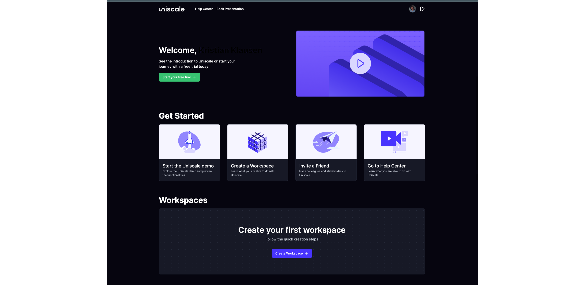

# Create a workspace

## What is a workspace?

A workspace is a container for your solutions and the people who work on them.

A space where you can invite your collaborators within or outside your company to contribute to different projects with their specific roles.


When you create your first workspace, you will also start your subscription with Uniscale. We offer a 30-day free trial period to make sure Uniscale is the right fit for you.


## How to create a workspace

You can create a workspace by following these 4 simple steps.

### Step 1: Click "Create Workspace"

From your Personal Dashboard, click "Create Workspace" on the green icon or under the Get Started  section

<figure><figcaption>
Personal Dashboard
</figcaption></figure>

### Step 2: Insert your Workspace Details

Fill out the required fields so you can have all the basic information on your new Workspace

<figure><figcaption>
Set up your Workspace
</figcaption></figure>

### Step 3: Select the right plan for you and your team

Choose your team size and select your new plan. You can learn more about plans and pricing here: [https://www.uniscale.com/pricing](https://www.uniscale.com/pricing)

<figure><figcaption>
Select a plan and get started
</figcaption></figure>

### Step 4: Include your billing and payment details

Insert your billing and payment details and click "Next"

<figure><figcaption>
Payment information
</figcaption></figure>

You will now be prompted into your new Workspace.&#x20;


It is now time to invite your colleagues to your new Workspace. Find [here](invite-to-a-workspace.md) how you can do this.&#x20;

