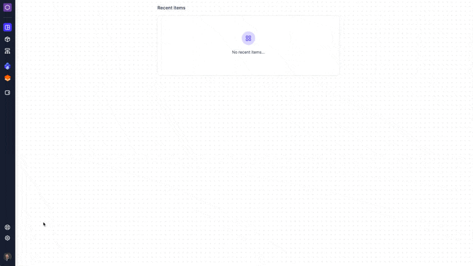

# Invite to a workspace

## Step-by-step guide: How to invite users to a workspace&#x20;

Follow these steps to make sure your colleagues can also access your Workspace:

<figure><figcaption></figcaption></figure>

***

### Step 1: Select workspace

Select the workspace you wish to invite people to by clicking "Go To"

### Step 2: Go to "settings"

From the workspace dashboard, click on "settings" on the left-hand side of the page

### Step 3: Go to "users"

From inside the "settings" menu select "users"

### Step 4: Invite User

Select "invite user" on the right-hand side of the page, filled in with the required information and send out the invitation


Do you need to upgrade your license to add more users?&#x20;

Please check this article on ["Plans and Subscriptions"](../../manage-billing-payments-and-plans/plans-and-subscriptions.md) or our [website ](https://www.uniscale.com/)for more information.


***

## Email verification

The _inivitee_ will now receive an email to join your workspace.&#x20;

<figure><figcaption>
Uniscale invitation - invitee verfication
</figcaption></figure>

### Next steps for admin and invitee:&#x20;


[getting-started-for-workspace-admins.md](../../getting-started/getting-started-for-workspace-admins.md)



[create-an-account.md](../../account-and-preferences/create-an-account.md)

