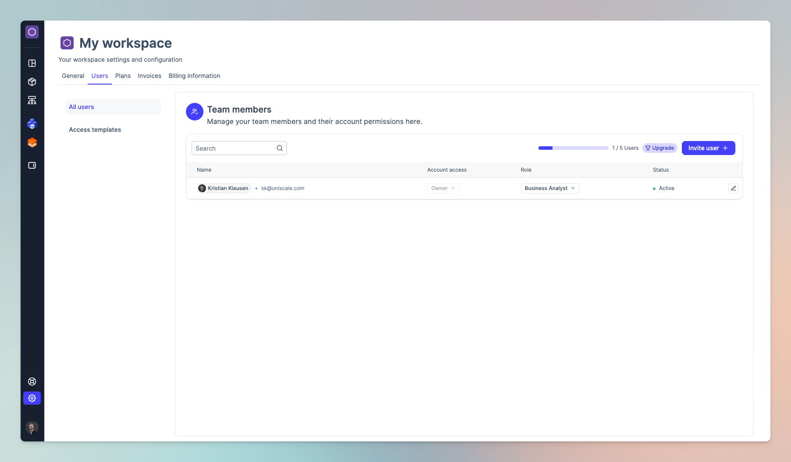

# User management

You can manage all team members within your workspace by accessing the workspace settings page.&#x20;

<figure><figcaption>
User management
</figcaption></figure>

## Account access

There are three types of Account access:

### Owner

Every workspace can only have one owner who will have access to everything within the workspace.

### Admin

An Admin user can both add or delete users to the Workspace as well as create and write functional and technical specifications.

### User

On the other hand, someone with User access can only create and write functional or technical specifications.

***

## Role

The roles will help you get an overview of what role the user has within your organization. This do not impact their permission level within the Uniscale workspace.

***

## Status

There are two types of status:

### Active

This indicates that the user has accepted the invite and have access to the workspace.

### Invitation sent

This indicates that the user has received the invitation email.
