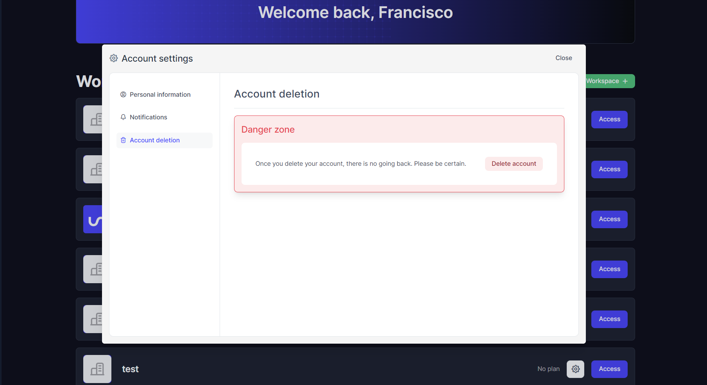

# How to edit my account settings

## Go to Account settings

From the Uniscale Dashboard click the profile icon on the bottom left corner of the page.

###

### Update personal information

Select "Personal Information" from the left-hand side. Update any of the fields and press "Save changes" when done.

<figure><figcaption>
Personal information
</figcaption></figure>

***

### Update email notifications

Select "Notifications" from the left-hand side

<figure><figcaption>
Account notifications
</figcaption></figure>

***

### Delete account

Select "Account deletion" from the left-hand side.&#x20;

<figure><figcaption>
Account deletion
</figcaption></figure>
